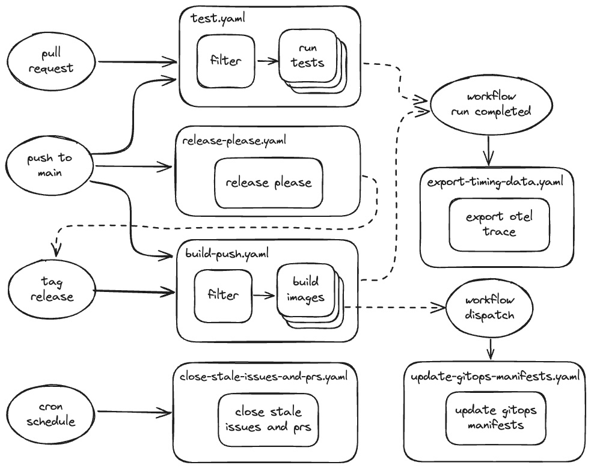

# Capstone – GitHub Actions Course Project

This repository contains the capstone project for the [DevOps Directive GitHub Actions course](https://github.com/sidpalas/devops-directive-github-actions-course). Top-level directories include .github/ (workflows, composite actions, and config), services/ (the microservices), deploy/kubernetes/, utils/, plus a root Taskfile.yaml used by many workflows.  

---

## Repo structure

```bash
.
├── .github/
│   ├── actions/                # Composite actions (e.g., setup-dependencies)
│   ├── utils/                  # release-please config, file-filters, etc.
│   └── workflows/              # All workflow YAML files listed above
├── deploy/
│   └── kubernetes/             # GitOps-style manifests
├── services/
│   ├── go/api-golang
│   ├── node/api-node
│   ├── python/load-generator-python
│   ├── react/client-react
│   └── other/api-golang-migrator
├── utils/                      # Helper scripts/tasks
├── Taskfile.yaml               # Shared task definitions used inside workflows
└── readme-assets/
```

---

## Workflows Overview



1. **Run Tests** – .github/workflows/test.yaml

    Triggers on push to main (only when files in services/** change), on any pull_request, and via workflow_dispatch. It uses dorny/paths-filter to detect changed services and fans out a matrix job to run tests per service using the local composite action ./.github/actions/setup-dependencies.  

2. **Build and Push Container Images** – .github/workflows/build-push.yaml

    Runs on:
      •	push to main (builds changed services),
      •	tagged releases matching **@[0-9]*.[0-9]*.[0-9]*, and
      •	manual workflow_dispatch (with service and optional version inputs).

    It logs into Docker Hub, sets up QEMU/Buildx, computes version & image tags via task commands, and pushes images. It then triggers the deploy workflow (update-gitops-manifests.yaml) with gh workflow run, but skips that step when running locally by checking env.ACT.  

3. **Update GitOps Manifests** – .github/workflows/update-gitops-manifests.yaml

    Manual only (workflow_dispatch) with inputs for service, version, image_tag, and target environment (development, staging, production). A concurrency group prevents manifest races per service/environment. It updates tags via task utils:update-image-tags-service and commits/pushes changes (again skipping the push when env.ACT is set).  

4. **Release Please** – .github/workflows/release-please.yaml

    Runs on push to main and manually. Uses googleapis/release-please-action with a PAT to open PRs and tag releases across multiple packages defined in .github/utils/release-please-config.json and .github/utils/.release-please-manifest.json.  

5. **Export GitHub Action Timing Data** – .github/workflows/export-timing-data.yaml

    Triggered by workflow_run (after Build and Push, Run Tests, or Release Please complete). It exports OpenTelemetry traces to Honeycomb using inception-health/otel-export-trace-action.  

6. **Close Stale Issues and PRs** – .github/workflows/close-stale-issues-and-prs.yaml

    Nightly cron (0 0 * * *) + manual trigger, using actions/stale to label/close inactive issues and PRs.  

### How the Pieces Fit Together
1.	PR or push to main → Run Tests.
2.	If main changes or a tag is pushed → Build & Push Container Images builds and publishes images, then triggers…
3.	Update GitOps Manifests to roll out the new tag to the chosen environment.
4.	Release Please automates versioning/changelogs across all services.
5.	Export Timing Data collects performance telemetry for the above workflows.
6.	Close Stale Issues and PRs keeps the project tidy.

---

## Iterating Locally with act

To run workflows locally with act (https://github.com/nektos/act), there are Taskfiles and event configurations located in `.github/workflows/<NAME_OF_WORKFLOW>`

For example to run the `test` workflow:

```bash
➜  capstone git:(main) ✗ cd .github/workflows/test
➜  test git:(main) ✗ task trigger-workflow 
task: [trigger-workflow] act pull_request \
  --container-architecture linux/amd64 \
  -s GITHUB_TOKEN="<GITHUB_TOKEN>" \
  -e <PATH_TO_EVENT_JSON> \
  -P ubuntu-24.04=catthehacker/ubuntu:act-22.04 \
  --directory ../../.. \
  -W .github/workflows/test.yaml
```

